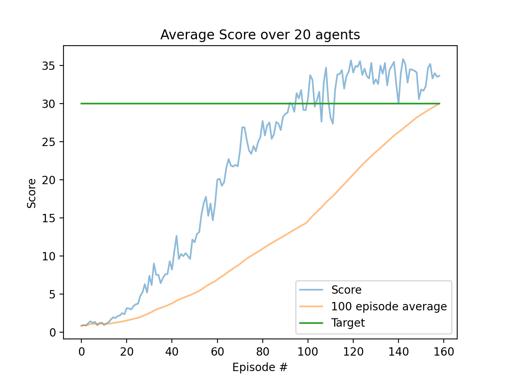

# Deep learning agent controls 2 armed robot arm

This repo solves the 'Reacher' environment as part of Udacity's Deep Reinforcement Nanodegree.

In this environment, a double-jointed arm can move to target locations. A reward of +0.1 is provided for each step that the agent's hand is in the goal location. Thus, the goal of your agent is to maintain its position at the target location for as many time steps as possible.

The observation space consists of 33 variables corresponding to position, rotation, velocity, and angular velocities of the arm (continuous state space). Each action is a vector with four numbers (continuous action space), corresponding to torque applicable to two joints. Every entry in the action vector should be a number between -1 and 1.


## Installation

The following should get you going:

#### Download and install Reacher environment

- Linux: [click here](https://s3-us-west-1.amazonaws.com/udacity-drlnd/P2/Reacher/Reacher_Linux.zip)
- Mac OSX: [click here](https://s3-us-west-1.amazonaws.com/udacity-drlnd/P2/Reacher/Reacher.app.zip)
- Windows (32-bit): [click here](https://s3-us-west-1.amazonaws.com/udacity-drlnd/P2/Reacher/Reacher_Windows_x86.zip)
- Windows (64-bit): [click here](https://s3-us-west-1.amazonaws.com/udacity-drlnd/P2/Reacher/Reacher_Windows_x86_64.zip)

#### Install dependencies

```
# create conda virtual environment
conda create --yes -n reacher python=3.6
conda activate reacher

pip install -r requirements.txt 
```

#### Run

To test everything is working first try `python test.py`. This will run for one episode with random actions.

If all looks good run with:

```
python agent_runner.py
```


## Results

See [report](REPORT.md) for details. Figure below plots the score over time.



