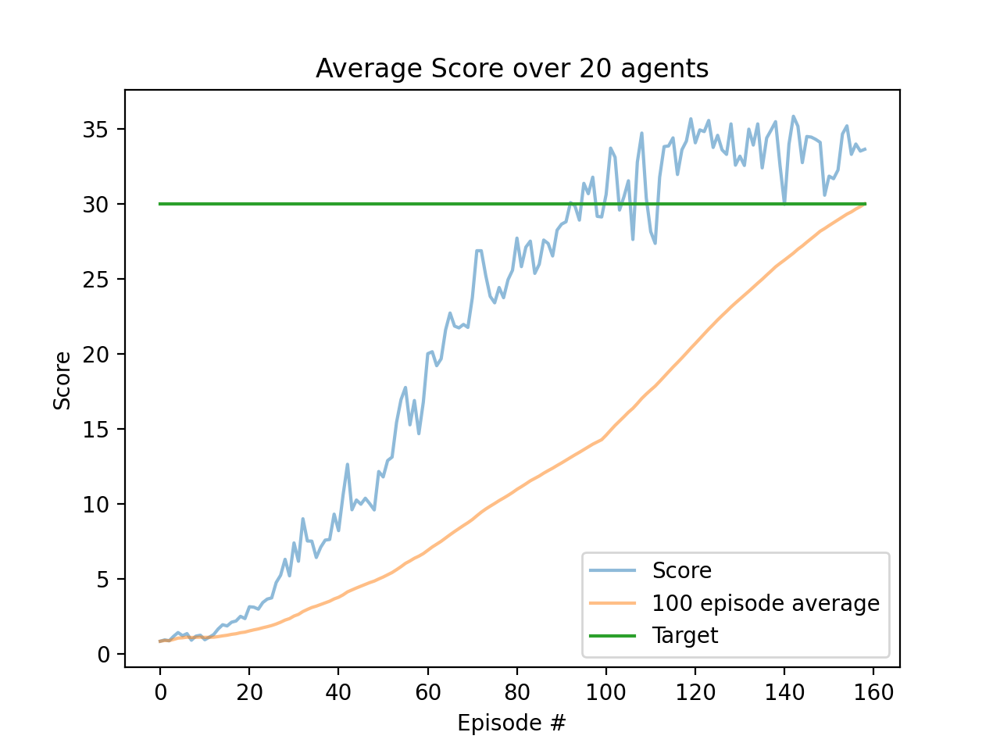

# Solving Reacher environment with DDPG

## Description of Algos used

### Failed attempt

I initially chose to solve the problem with the Advantage Actor Critic (A2C) method. I chose this because it works with continuos spaces, is well suited to the 20-agent environment, and simple to implement. I was attracted to the simplicity. It is a true actor-critic method with the actor using monte-carlo method for its updates. There is no replay buffer. The method uses n-step bootstrapping. I customised this to allow longer rollouts if insufficient reward had been collected. I found this helpful to speed up learning early on. 

The algo performed well early on, getting an average score > 8 in episode 4. Unfortunately it was unstable and crashed soon thereafter. No tweaking of hyperparameters was helping. I then decided if I was going to have to add features to stabilise the algo, I'd might as well try another approach.

### Successful attempt

I had great success with the Deep Deterministic Policy Gradient  (DDPG) method ([original paper](https://arxiv.org/abs/1509.02971v5)). This method has been described as DQN for continuous action spaces. It is set up in an Actor - Critic architecture although its debatable if it really satisfies this term because it uses a TD estimate to estimate rewards. The actor network learns to select actions deterministically. The actor uses the 'critic' for its estimate of future rewards. 

One of the key features of DDPG to stabilise learning is that they make a copy of the actor and critic networks and use these as the target policy. The target networks are updated very slowly and this improves stability dramatically. The way in which the target is updated was also novel when the algo was invented. They slowly leak weight updates  from the learning networks at every timestep. So the target is always being updated but very slowly to keep stability.

DDPG makes use of a replay buffer as in DQN to remove correlations between samples.

Another feature of DDPG is the addition of noise to the process to improve exploration.

My final model used the following hyper parameters:

* Networks all have two hidden layers with 256 nodes in layer 1 and 128 in the second
  * Actor produces 4 continuous actions in the range (-1,1) using a tanh activation
  * Critic produces one Q-value without any activation
* Disount factor (gamma) of 0.99
* Replay buffer size of 100 000 samples
* Minibatch size of 128
* Soft update rate tau of 0.001
* Adam optimisers with learning rates of 1e-4 for actor and 1e-3 for the critic
  * Critic more stable, so can use a higher learning rate

## Results

Figure below shows a plot of the score over time. The network performed extremely well, first exceeding a score of 30 after ? episodes, and maintaining above this average for 100 further episodes.

## Future work

I believe prioritized experience replay would help the network learn faster. 

On the network architecture:

* I could also get more fancy with weight initialisation like Kaimer
* I could add dropout layers to ensure the network generalizes well (perhaps improving stability)